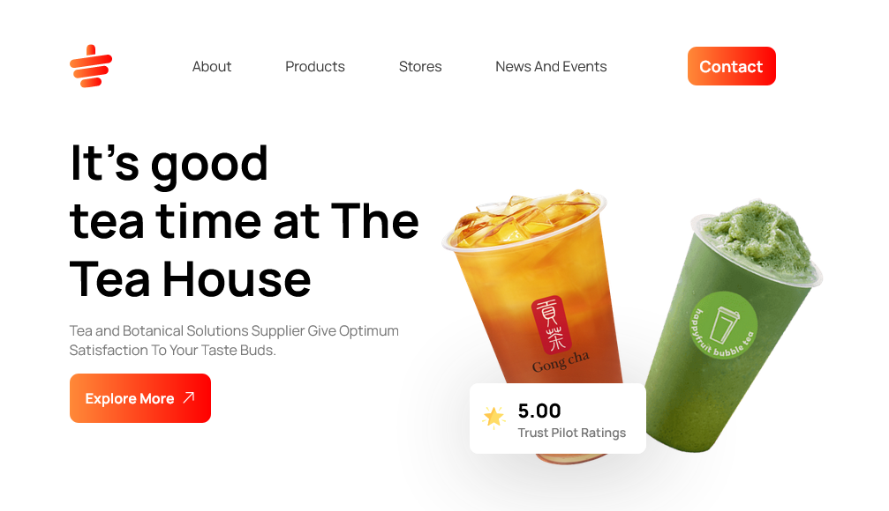

 

  

  <h3 align="center">Tea House Practice Project</h3>

  

    <a href="https://asibhossen897.github.io/tea-house">View Demo</a>
    .
    <a href="https://github.com/asibhossen897/tea-house/issues">Report Bug</a>
    .
  

  

## Table Of Contents

- [About the Project](#about-the-project)
- [Built With](#built-with)
- [Authors](#authors)

## About The Project

I was really curious about my CSS skills. So brother <a href="https://github.com/SiyamMahdi">Siyam Mahdi</a> suggested me to take on this project from Figma file which was provided by <a href="https://github.com/ProgrammingHero1">Programming Hero</a>. So I started working on this project and as far and deep I went into this, my confidence level boosted and I learned so many things. This is not perfect yet but I'm trying my best. 😍  
Jazakumullahu Khairan to <a href="https://github.com/SiyamMahdi">Siyam Mahdi</a> and <a href="https://github.com/ProgrammingHero1">Programming Hero</a>

## Built With

HTMl and Raw Css

## Authors

- **Asib Hossen** - _Student_ - [Asib Hossen](https://github.com/asibhossen897)
